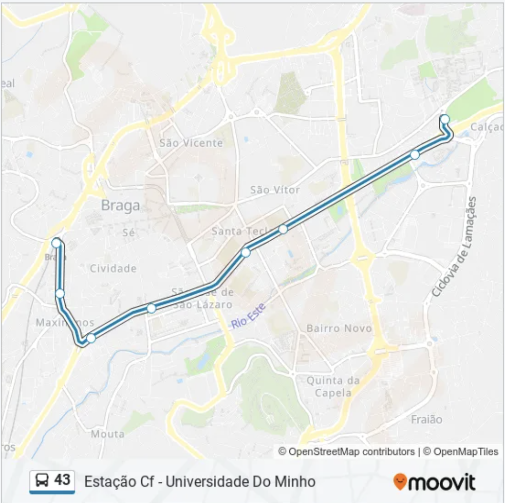

# Multiagents-transport

It's an effort to create a multi-agent system that simulates a transportation system on Linha 43, Braga. The system is composed of three types of agents: passengers, buses, and a manager. The passengers are the agents that want to travel from one station to another. The buses are the agents that transport the passengers. The manager is the agent that controls the system, assigning buses to routes and managing the passengers.



# Diagrams

- [Class Diagram](https://tinyurl.com/yyu3b9nv)
- [Sequence Diagram](https://tinyurl.com/2p8y92p6)
- [Activity Diagram](https://tinyurl.com/rwde6peu)

# Agents

## Bus

The bus agent symbolized the buses that transport passengers from one station to another. These agents are defined by the classes:

Attributes of the class Bus:

- idBus: Unique identifier for the bus
- route: The route assigned to the bus
- passengers: List of passengers currently on the bus
- current station: The current station where the bus is located
- running: Boolean indicating whether the bus is currently running
  The methods of a bus include the following:
- add passenger(): Adds a passenger to the bus
- remove passenger(): Removes a passenger from the bus

Behaviour for the bus agent:

- UpdateBusLocation – Periodic ​
- NotifyManagerBusStarted – OneShot​
- CurrentBusLocationUpdate – OneShot​
- NotifyManagerBusEnd – OneShot

## Passenger

The passenger agent symbolizes the passengers who utilize our transportation system.

Therefore, these agents will ride a bus from an initial station to their destination, disembarking upon arrival or when the bus finishes its route. To act effectively, these agents communicate with the manager agent.

These agents are defined by the classes:

- Passenger
- PassengerAgent

The first class defines the basic structure of a passenger, with attributes that represent them.

```py
class Passenger:
    def __init__(...):
    def to_dict(...):
    @classmethod
    def from_dict(...):
    def __str__(...):
    def leave_bus(...):
```

So, this class allows us to create passengers with the following attributes:

- idPassenger - unique id for each passenger.
- route - the route the passenger wishes to travel on
- bus - the bus the passenger is currently on
- initialStation - the station where the passenger starts on

On the other hand, class PassengerAgent has the following methods:

```py
class PassengerAgent(Agent):
    def __init__(...):
    async def setup(...):
    def enterBus(...):
    async def leftBus(...):
    async def recieveBusLocation(...):
    async def leaveBus(...):
    async def receivedMessage(...):
```

This class defines passenger agents and relies on the previous class to define the structure of the agent.

The methods showcase the actions performed by these agents, which can be registered on the platform by the manager agent, enter and leave buses and analyze the location of buses. This class also requires a method to receive and process messages sent by the manager.

Utilizing the listed methods, these agents execute the following behaviours:

- `PassengerBehaviour`: initial behaviour responsible for creating the passenger. It is a _CyclicBehaviour_ that ensures the passenger awaits messages from the manager.

- `EnterBusBehaviour`: behaviour that represents the act of entering a bus. It is _OneShotBehaviour_ that sends a message to the manager informing the change in the system.

- `LeftBusBehaviour`: behaviour that represents the act of leaving a bus. It is a _OneShotBehaviour_ that just like the previous one also sends a message to the manager to inform the change in the system.

## Manager

So now we will explain everything related with the manager agent.

This agent represents the central part of our system. This is the part that will know how many buses or passengers are in the system, how many passengers are waiting, which passengers are inside a specific bus, and so on. The manager is crucial to our system since it is this agent that is responsible for assigning buses to the routes.

The classes involved with this agent are:

- Manager
- ManagerAgent

The class _Manager_ is a simple class that just stores the data and has some helpful functions.

```py
class Manager:
    def add_bus(...):
    def add_passenger(...):
    def add_route(...):
    def update_bus_location(...):
    def get_passengers_bus(...):
    def get_passengers_route(...):
    def route_needs_bus(...):
    def passenger_entered(...):
    def passenger_left(...):
    def busEnded(...):
    def busStarted(...):
    def pick_random_bus_available(...):
```

On the other hand, _ManagerAgent_ is the class that represents the agent itself. So this class has multiple methods, one for when the agent receives a message/request `receivedMessage` and others to handle specific requests.

```py
class ManagerAgent(Agent):
    async def setup(...):
    def registerBus(...):
    def registerPassenger(...):
    def setRouteBus(...):
    def busStarted(...):
    def busEnded(...):
    def passengerEntered(...):
    def passengerLeft(...):
    def notifyBusLocation(...):
    def updateBusLocation(...):
    def receivedMessage(...):
```

In relation to the behaviours, this agent has many behaviours involved. Those are:

- `ManagerBehaviour`: Behaviour that waits for messages from the buses or passengers.
- `NotifyBusPassengerBehaviour`: Notifies a bus when a new passenger has entered or left the specific bus.
- `NotifyBusRouteBehaviour`: Notifies a bus that it was assigned to a route.
- `NotifyPassengerBusEndBehaviour`: Notifies a passenger that the bus they were inside has ended its route.
- `NotifyPassengerBehaviour`: Notifies a passenger about a bus location.

# Messages

In this section, we will explain in detail every message that the agents already mentioned send to each other. All the code associated with the messages is inside the folder `Utils/`. `Request.py` is a file that contains functions to serialize the message. In this file, we specify the performative, the body, and other important attributes of the messages. The file `MessageBuilder.py` is just a file with functions to build the messages themselves. The file `Performative.py` contains all the performatives that we have used.

To sum up, the following table summarizes the message exchange between the agents.

| Function                        | Performative | Origin    | Destiny   | Description                                                 |
| ------------------------------- | ------------ | --------- | --------- | ----------------------------------------------------------- |
| serializeRegisterPassenger      | _subscribe_  | Passenger | Manager   | Register a passenger with the manager.                      |
| serializeRegisterBus            | _subscribe_  | Bus       | Manager   | Register a bus with the manager.                            |
| serializeBusStart               | _confirm_    | Bus       | Manager   | Inform the manager that a bus has started its route.        |
| serializeBusEnd                 | _confirm_    | Bus       | Manager   | Inform the manager that a bus has ended its route.          |
| serializePassengerEntered       | _inform_     | Passenger | Manager   | Inform the manager that a passenger has entered a bus.      |
| serializePassengerLeft          | _inform_     | Passenger | Manager   | Inform the manager that a passenger has left a bus.         |
| serializeBusNewLocation         | _inform_     | Bus       | Manager   | Inform the manager about the current location of a bus.     |
| serializeNotifyPassenger        | _inform_     | Manager   | Bus       | Notify a specific bus about its assigned route.             |
| serializeNotifyPassengerBusEnd  | _inform_     | Manager   | Passenger | Notify a specific passenger that their bus route has ended. |
| serializeNotifyBusNewPassenger  | _inform_     | Manager   | Bus       | Notify a specific bus that a passenger has boarded.         |
| serializeNotifyBusPassengerLeft | _inform_     | Manager   | Bus       | Notify a specific bus that a passenger has disembarked.     |
| serializeNotifyBusRoute         | _request_    | Manager   | Bus       | Request the manager to assign a route to a specific bus.    |

# How to run the project

```bash
python3 ManagerMain.py
python3 BusMain.py 1
python3 PassengerMain.py 10
```

Data/util.json file:

```
{
  "server": "you xmpp server"
}
```

pygame version

```
pip show pygame
Name: pygame
Version: 2.5.2
Summary: Python Game Development
Home-page: https://www.pygame.org
Author: A community project.
Author-email: pygame@pygame.org
License: LGPL
Location: /Users/abhi/miniconda3/envs/agents/lib/python3.9/site-packages
Requires:
Required-by:
```
